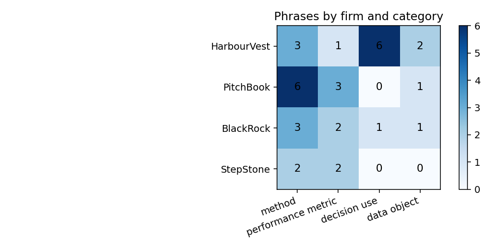
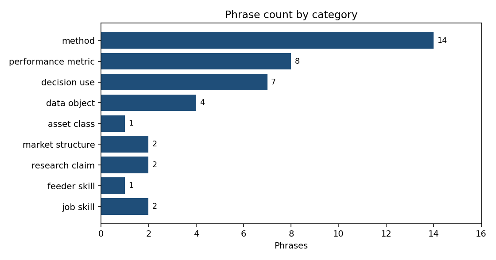
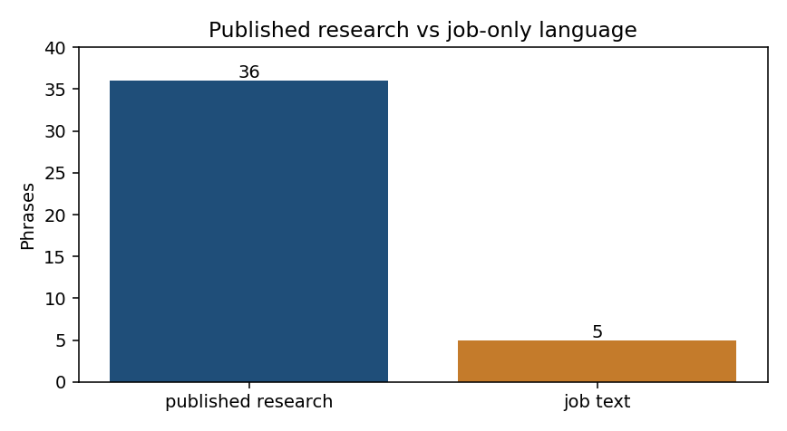

# Private market trends

Language of private-markets quant research: what firms publish, and what they ask for.

Sources are HarbourVest QIS, PitchBook, BlackRock Aladdin / Preqin, and StepStone. Phrases are in `data/raw/research_keywords.csv` (41 rows). Counts below use that table only.

## Firm by category

HarbourVest writes about decisions. PitchBook writes about methods and multiples. BlackRock and StepStone are split between methods and performance metrics.

| Firm | Method | Performance metric | Decision use | Data object |
| --- | ---: | ---: | ---: | ---: |
| HarbourVest | 3 | 1 | 6 | 2 |
| PitchBook | 6 | 3 | 0 | 1 |
| BlackRock | 3 | 2 | 1 | 1 |
| StepStone | 2 | 2 | 0 | 0 |

HarbourVest's decision-use phrases are sector weight, timing, public-market comparison, manager selection, portfolio construction, and liquidity. PitchBook's methods are cash-flow forecasting, the Takahashi-Alexander model, Monte Carlo, z-score, manager score, and cash-flow speed.

## Category mix

Methods are the largest class. Market structure is two phrases: J-curve and GP-led secondaries.

| Category | Phrases |
| --- | ---: |
| Method | 14 |
| Performance metric | 8 |
| Decision use | 7 |
| Data object | 4 |
| Market structure | 2 |
| Research claim | 2 |
| Job skill | 2 |
| Asset class | 1 |
| Feeder skill | 1 |

## Research language and job language

Five phrases appear only in job text: Bayesian, time series, quantitative equity, Python, and SQL. Four appear in both: nowcasting, Monte Carlo, liquidity management, and GP-led secondaries. The rest are published research.

Python and SQL are in every current posting and are not tied to one firm. Quantitative equity is the HarbourVest feeder requirement. Bayesian and time series are named only on the BlackRock private-markets modeler seat.

## Not a time trend

Each phrase has one source date. Counting them by year would repeat the document list, not a shift in research. A trend chart needs the same phrases counted in notes from 2022 through 2026.
